# Canvenient Architecture — Native macOS Workbench

Canvenient is a native macOS productivity workbench for NUS students, built with **Tauri v1**, **React 19**, and a **FastAPI backend** running as a local sidecar process.

---

## 1. High-Level Architecture

```mermaid
graph TD
    subgraph Native macOS Window [Tauri Desktop Shell]
        UI[React 19 Frontend - Vite]
        App[App.jsx] --> Auth[LoginForm / RegisterForm]
        App --> Shell[WorkspaceLayout.jsx]
        Shell --> Rail[48px Icon Rail / Sidebar]
        Shell --> Toolbar[40px Native Drag Toolbar]
        Shell --> Views[Active View Container]
        Toolbar --> TimerPopover[StudyTimerModule Popover]
        Toolbar --> QuickCapture[TaskInputBar Modal]
    end

    subgraph Views [Canonical Workbench Views]
        V1[Dashboard.jsx 70/30 Workbench]
        V2[TaskView.jsx Tasks Engine]
        V3[Schedule.jsx Timetable + Bus]
        V4[VenueFinder.jsx Study Venues]
        V5[CanvasView.jsx Canvas LMS]
        V6[NotesView.jsx Markdown + Graph]
        V7[SettingsView.jsx Native macOS Settings]
        V8[GroupsView.jsx Group Collaboration]
        V9[wheel/SpinWheelView.jsx Deciders]
    end

    subgraph Backend [FastAPI Sidecar Process]
        API[http://127.0.0.1:8000]
        DB[(SQLite canvenient.db)]
        CanvasSync[Canvas LMS API Sync]
        NUSModsSync[NUSMods & Venues Sync]
        ISBSync[NUS ISB Bus Engine]
        AIEngine[AI Brief & Assistants]
        TelegramBot[Telegram Sync Bot]
    end

        Views --> V1
        Views --> V2
        Views --> V3
        Views --> V4
        Views --> V5
        Views --> V6
        Views --> V7
        Views --> V8
        Views --> V9

    UI -- HTTP REST / SSE --> API
    API --> DB
    API --> CanvasSync
    API --> NUSModsSync
    API --> ISBSync
    API --> AIEngine
    API --> TelegramBot
```



---

## 2. Directory Structure

```
├── AGENTS.md                  <- Agent guardrails and active architecture rules
├── README.md                  <- Setup and development guide
├── desktop.sh                 <- Launches backend + Tauri desktop app
├── start.sh                   <- Launches backend + Vite dev server (browser)
├── docs/
│   ├── ARCHITECTURE.md        <- This document
│   ├── AI_WORKING_AGREEMENT.md<- Non-negotiable agent safety rules
│   └── PROJECT_STATE.md       <- Log of accepted checkpoints and safepoints
├── backend/                   <- FastAPI Python backend
│   ├── main.py                <- Entrypoint for local Uvicorn dev
│   ├── run.py / run.spec      <- PyInstaller entrypoint for Tauri sidecar
│   ├── database.py            <- SQLite database connection
│   ├── routes/                <- API endpoints (tasks, canvas, bus, ai, etc.)
│   └── tests/                 <- Backend pytest suite
├── frontend/                  <- React 19 + Vite frontend
│   ├── src-tauri/             <- Tauri v1 Rust configuration & sidecars
│   └── src/
│       ├── App.jsx            <- Root router and session hydration
│       ├── api.js             <- Client API methods
│       ├── index.css          <- Global tokens, typography, and native layout rules
│       ├── components/        <- CANONICAL ACTIVE COMPONENTS ONLY
│       │   ├── WorkspaceLayout.jsx  <- Main window shell (rail, toolbar, routing)
│       │   ├── Dashboard.jsx        <- 70/30 workbench grid
│       │   ├── dashboard/           <- Dashboard module widgets (Tasks, Canvas, Wheel, etc.)
│       │   ├── TaskView.jsx         <- Full tasks management view
│       │   ├── Schedule.jsx         <- Timetable and NUS ISB bus integration
│       │   ├── VenueFinder.jsx      <- Free room and venue finder
│       │   ├── CanvasView.jsx       <- Canvas LMS assignments, files, and PDF preview
│       │   ├── PdfViewer.jsx        <- pdfjs-based viewer for Canvas file previews
│       │   ├── NotesView.jsx        <- Markdown notes and knowledge graph
│       │   ├── GroupsView.jsx       <- Group collaboration (groups, invites, group tasks)
│       │   ├── wheel/               <- Spin-the-wheel and decider views
│       │   ├── SettingsView.jsx     <- Native macOS settings view
│       │   ├── drawers/             <- Contextual overlay drawers
│       │   └── editor/              <- Tiptap markdown editor extensions
│       └── legacy/            <- ARCHIVED LEGACY WEB APP COMPONENTS (DO NOT USE)
└── scripts/
    ├── rebuild-install-macos.sh <- Builds & installs to /Applications/Canvenient.app
    └── legacy_patches/          <- Archived one-off migration & patch scripts
```

---

## 3. Canonical vs Legacy Components

| Feature Area | Canonical Active Native Component | Obsolete / Archived Legacy File |
| :--- | :--- | :--- |
| **Dashboard** | `src/components/Dashboard.jsx` + `dashboard/*` | `src/legacy/TaskManagerDashboard.jsx` |
| **Settings** | `src/components/SettingsView.jsx` | `src/legacy/Settings.jsx` |
| **Sidebar / Rail** | `src/components/WorkspaceLayout.jsx` | `src/legacy/Sidebar.jsx`, `src/legacy/SlimSidebar.jsx` |
| **Tasks** | `src/components/TaskView.jsx` & `dashboard/TasksModule.jsx` | `src/legacy/TasksPage.jsx` |
| **Study Timer** | `src/components/dashboard/StudyTimerModule.jsx` | `src/legacy/StudyTimer.jsx`, `FloatingStudyTimer.jsx` |
| **AI Brief** | `src/components/dashboard/AiBriefModule.jsx` | `src/legacy/AiBrief.jsx` |
| **Team / Groups** | `src/components/GroupsView.jsx` (revived for the personal workbench) | `src/legacy/Organisations.jsx`, `JoinGroupLink.jsx` |
| **Deciders** | `src/components/wheel/SpinWheelView.jsx` + `dashboard/WheelModule.jsx` | — |
| **Day Hub** | `src/components/Dashboard.jsx` | `src/legacy/TodayHub.jsx` |
| **Workspace Shell** | `src/components/WorkspaceLayout.jsx` | `src/legacy/TerminalWorkspace.jsx` |

---

## 4. Key Design Principles (per `design.md`)

1. **Genre**: Modern-minimal native macOS workbench.
2. **Theme**: Default graphite dark theme (`#101113`) with subtle close-value charcoal steps and white hairline borders (7–12% opacity).
3. **Typography**: Native macOS system sans (`-apple-system, BlinkMacSystemFont`). Hierarchy comes from contrast and spacing, not novelty.
4. **Layout**:
   - 48px compact icon rail on the left (hover/pinned expandable).
   - 40px top toolbar with native window drag region.
   - Central 70/30 workbench (dominant Tasks surface on the left, contextual side modules on the right).
